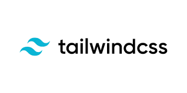

# Platepal project

This project is aimed at learning and flexing muscles on Tailwind CSS
Acts as an introductory project to tailwind and handles the following:
- Introduction and project setup
- HTML template
- Tailwind Fonts and colors
- Margin, Padding and Borders
- Tailwind config
- Custom fonts
- Tailwind flexboxes
- Cards
- Badges
- Grids
- Buttons
- Icons
- Hover Effects
- Nav responses
- Transitions

## File setup and environment
run `npm install` to install all the dependencies needed for the project

## Operation
To start the web app run `live-server public`
